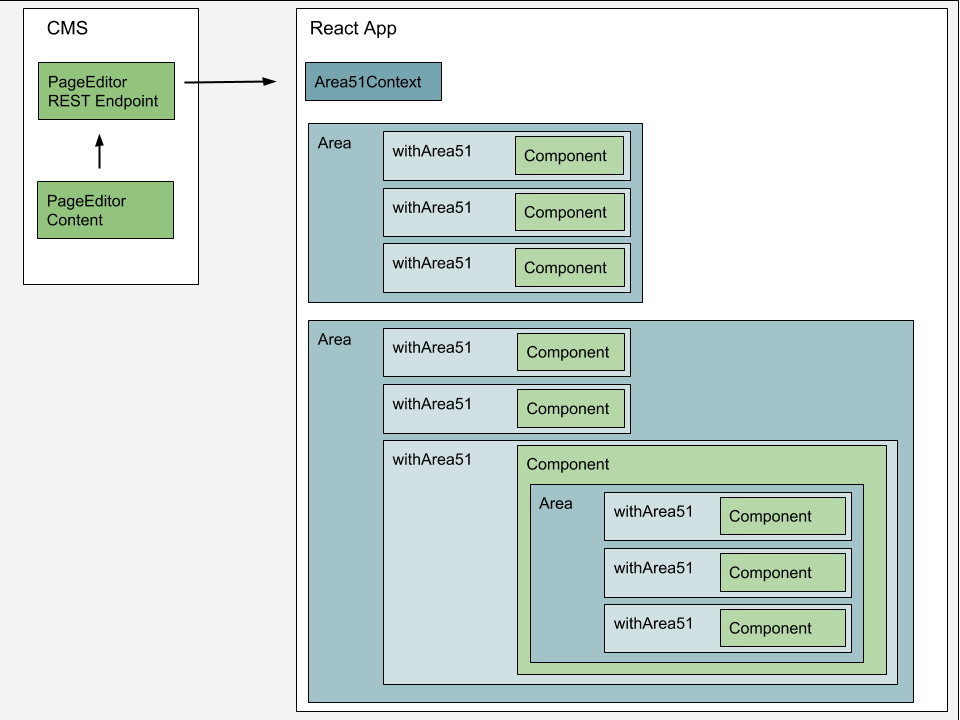

# Area51
Area51 allows mysterious alien content to take control of your React app.

*This is software in development. Alpha. Subject to frequent change.*

Area51 enables content authors to manage the actual structure and layout of a React app, not just the content items. It was created to re-empower non-developers to create and edit React-based websites and other digital experiences. Area51 connects the modern component-architecture of React, with the component concept of CMS page editors.
It does not include an editing tool itself, but provides the infrastructure an editing UI can plug into.

Capabilities

* Use any React component without modification. They get all CMS content passed in as props.
* Supports nested components.
* Supports multiple pages.

Screenshot of React Demo Project being edited in a CMS.

# How Area51 works

Area51 provides an `Area` React component that is dynamically populated with React components and content based on a JSON configuration, typically from a CMS REST endpoint.
The configuration stores both an ordered list of React components, and their content, which will be passed as props to the instantiated React components. Because an instantiated React component may itself contain an area, the configuration can also be a tree, instead of a list.
In an edit mode, Area51 adds markup or data attributes to the Area component and its child components to allow an external tool to add an editing UI to interact with the configuration.
The Area51 library is CMS-agnostic, additional CMS-specific libraries can leverage it to connect to their editing UI and content structures.

# How to develop these libraries and demo (or just try it out).

As the project is rapid development, we currently host three things in this repo, two libraries (react-area51, magnolia-react-area51) & a demo project (Area51 Aliens) that shows the nested areas and multipage support in action.

This Git repo contains binding to a simple Magnolia CMS project for demonstration purposes.
 
 **Setup Magnolia CMS:**

1. Clone the repository
2. Use the Magnolia CLI to install Magnolia 5.6.5+ in the directory. (Terminal: `mgnl jumpstart -m 5.7.2`. Tip: choose `magnolia-community-demo-webapp` because it will configure CORS for you.)
3. To easily install necessary config and sample content, copy the contents from `_dev/import-this-manually` into `apache-tomcat/webapps/magnoliaAuthor/WEB-INF/bootstrap/common 
`. (Otherwise use standard Magnolia import functionality to bring it in.)
3. Start Magnolia. (Terminal: `mgnl start`)
4. In Magnolia Pages app, open `solar-system`, you should see the demo project (A React app!) and be able to edit it! (This is because the React app is deployed to `/light-modules/react-aliens/webresources/static`)

## React code
Running the React App, outside of the Page Editor - aka in 'Headless' configuration:

To work on the either of the libraries and the demo project, in order to have the comfort of live updates you will typically want to get the source code and have three simple terminal based development servers in three terminal tabs.

**Setup React Code:**

* react-area51
  * The base library. 
  * `npm install`
* magnolia-react-area51
  * The CMS-specific library, for Magnolia.
  * `npm install`
* react-app
  * The demonstration project.
  * `npm install`

TIP: if any of your `npm install`'s fails with a message about 'ast' module, try deleting the package-lock.json and running the install again.

**Running the React development setup:**

With this setup, whenever you change any file in any of the projects, the full demo will automatically rebuild.

* react-area51
  * `npm run build`
  * Runs webpack with a watch configuration.
  * Builds `./lib/ReactArea51.js`
* magnolia-react-area51
  * `npm run build`
  * Runs webpack with a watch configuration.
  * Builds `./lib/MagnoliaReactArea51.js`
* react-app
  * `npm start`
  * Opens running app in a browser.
  * Depends on the `MagnoliaReactArea51.js` library.

**Deploy:**

To apply the changes to react-app (and the libraries) in the Magnolia Page editor, deploy the app to Magnolia by running:
`npm run build`

# How to Use Area51 in your React project (Eventually!)

*Note: this is how it will work once we leave Alpha. For now both libraries and the demo are in this one project to facilitate experimentation and development.*

Find the Area51 library for your CMS or editor. If one does not exist you will need to create one.
Setup
* Install the Area51 npm package. (It provides `Area` and `Page` components.) (Not existing yet, just use a 'file' reference in the package.json)
* Place `Area` (or `Page`) components in your existing React app wherever you want externally managed components. [Example](magnolia-react-area51-demo/react-app/src/app/component/SlideShow.js)
* Configure these props on your Area components:
  * cmsAreaName: The name of the corresponding area in your CMS.
  * parentPath: The full path to the CMS content node that will hold the areas contents. (Typically dynamically generated.)
  * parentTemplateId: The name/ID of the template of the node hosting this area in your CMS.
* Create a mapping configuration file so Area51 can map the template ID's in your CMS with the React components to be instantiated. You can use **any** React component. [Example](magnolia-react-area51-demo/react-app/src/app/mapping.js)
* Configure the environment variables to point to your CMS instance. [Example](magnolia-react-area51-demo/react-app/src/environments/environment.js)
* Modify the package.json `clean` and `copy` npm scripts to deploy to your CMS location.

# Technical Details

The React application loads the JSON with the content and stores this in a React Context `Area51Context`.

The `Area` (and `Page`) components instantiate React components using React.createComponent(), and wrap each component with an HOC `withArea51` which grabs the appropriate content from the `Area51Context` and passes it directly as `props` to the component.

`withArea51` also provides the 'EditorHints' which allow the components to be managed in the CMS. 

